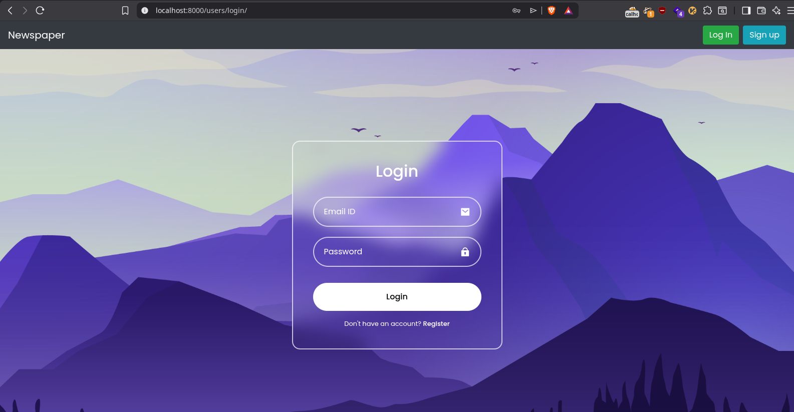
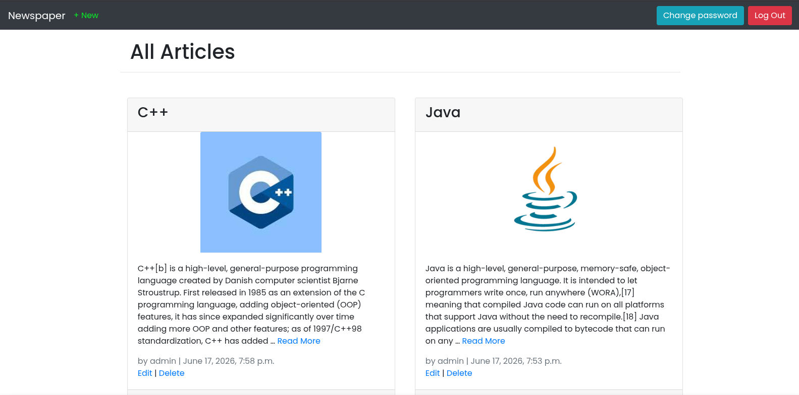
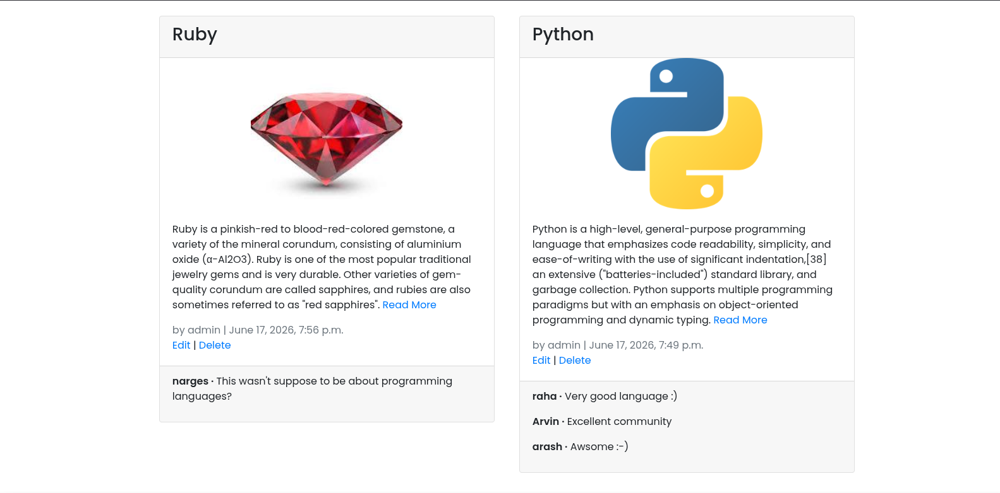

# Newspaper App

A Web App made using `django` framework. The frontend is made using `html` and `bootstrap` and `sqlite3` is used as the database. You can add articles which can be viewed by anyone. Just make an account and you are good to go.

  
   

  
   

  
   

 

## Requirements

Python 3.8  
Django 3.1

## Setting up the Project

  * Download and install Python 3.8
  * Download and install Git.
  * Clone the repository to your local machine `$ git clone https://github.com/ahghanbari/Django-News_App.git`
  * Change directory to newspaper-app `$ cd Django_News_App`
  * Install virtualenv `$ pip install virtualenv`  
  * Create a virtual environment `$ python3 -m venv .venv`
  * Activate the env: `$ source .venv/bin/activate`
  * Install all requirements `$ pip install -r requirements.txt`
  * Make migrations `$ python manage.py makemigrations`
  * Migrate the changes to the database `$ python manage.py migrate`
  * Create superuser `$ python manage.py createsuperuser`
  * Run the server `$ python manage.py runserver`
  
## Deployment
Here's a list of steps to be followed for deploying an app to heroku:

  * Run pipenv lock to generate the appropriate Pipfile.lock `$ pipenv lock`
  * Then create a Procfile which tells Heroku how to run the remote server where our code will live. `$ touch Procfile`
  * For now we’re telling Heroku to use gunicorn as our production server and look in our <project-file-name>.wsgi file for further instructions. `Update Procfile with - web: gunicorn <project_name>.wsgi --log-file - `
  * Next install [gunicorn](https://gunicorn.org) which we’ll use in production while still using Django’s internal server for local development use. `$ pipenv install gunicorn==19.9.0`
  * Finally update ALLOWED_HOSTS with '*' in settings.py file.
  * push the updates to the GitHub repository.
  * Login to heroku. `$ heroku login`
  * Create a new heroku app. `$ heroku create <app_name>`
  * Set git to use the name of your new app when you push to Heroku. `$ heroku git:remote -a <app_name>`
  * If there are no static files run `$ heroku config:set DISABLE_COLLECTSTATIC=1`
  * Push the code to Heroku. `$ git push heroku master`
  * Add free scaling so the app is actually running online. `$ heroku ps:scale web=1`

## Contributing

Feel free to raise a issue or make a pull request to fix a bug or add a new feature. If you are new to open source you can first read about git by [clicking here](https://www.codecademy.com/learn/learn-git).

